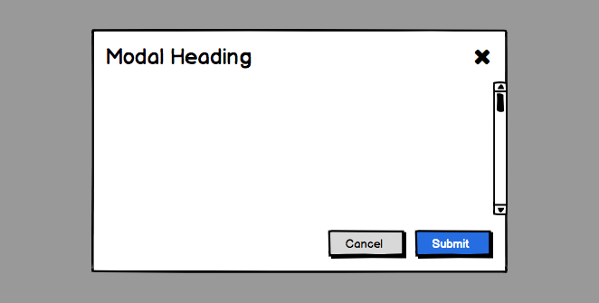

# Exercise - React and CSS

A simple exercise for assessing a developers basic skills working with React and CSS. Ideally, it should be performed more like a pair programming session than a take-home test, as much of the value comes from the conversation it creates.

**Time to complete:** < 1 hour

## Goal

The goal of this exercise is to create a simple reusable `Modal` component. The purpose is not necessarily to implement an exact design, but rather to design a useful API for reusability and to achieve the layout requirements.

This is a simple mockup of what we will be creating.

## Requirements

- The `Modal` component we create is reusable and customizable. The approach to this reusability is open-ended and up to you.
- The modal should not overflow the browser window. If it would, the content should collapse and become scrollable. The header and footer should remain at the top and bottom of the window.

## Additional Information

- A close icon is provided here: `src/images/icon-close.svg`.
- A simple `Button` component is provided here: `src/components/Button/Button.jsx`.
